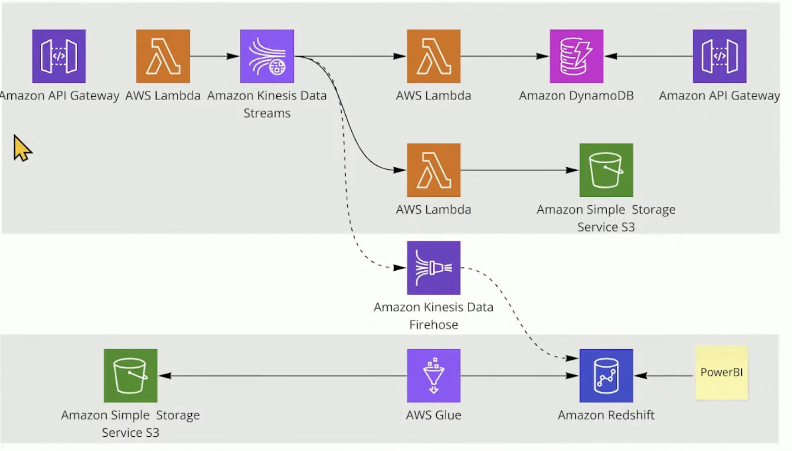

# AWS Data Engineering Project: Stream + Batch Pipelines

Data Source: [Ecommerce data from Kaggle](https://www.kaggle.com/datasets/carrie1/ecommerce-data)

This project demonstrates the implementation of both streaming and batch data pipelines for end-to-end data ingestion, processing, storage, and serving, leveraging multiple AWS services.

## Pipeline Flow
### Stream pipeline flow
1. **Client → API Gateway**: Python client to simulate real-time data by sending JSON events to an API Gateway endpoint.
2. **Writing to Kinesis**: When a request comes in, lambda functinos gets triggered to writes the request body to Kinesis stream.
3. **Kinesis consumers**: When data comes into the Kinesis stream, 2 lambda functions and Firehose process gets triggered
  - **Writing to DynamoDB**: Upserts into DynamoDB tables `customer` and `invoice`. The data is made available through via API Gateway.
  - **Writing to S3**: Appends raw events to S3 bucket. The data is later used in the batch processing.
  - **Firehose → Redshift**: Stream data delivery into Redshift. The data was then used to

### Batch pipeline flow
- **Glue Job**: Transfers raw data stored in S3 to Redshift by referencing the AWS Glue Data Catalog with null-handling and schema mapping.

## AWS Tech Stack
### API & Gateway Services
- **API Gateway**: REST API endpoint for client requests

### Compute Services
- **AWS Lambda**: Serverless functions for stream processing and API handling

### Streaming & Data Processing
- **Amazon Kinesis Data Streams**: Real-time data streaming
- **Amazon Kinesis Data Firehose**: Managed delivery to Redshift
- **AWS Glue**: ETL service with Data Catalog for schema management

### Storage Services
- **Amazon DynamoDB**: NoSQL database for `customer` and `invoice` tables
- **Amazon S3**: Object storage for raw event data
- **Amazon Redshift Serverless**: Data warehouse for analytics

### Security & Networking
- **IAM**: Identity and access management for service permissions
- **VPC Endpoints**: Private connectivity for S3, DynamoDB, and other AWS services to avoid internet routing

## Improvements to be made
- **IAM Privilege Management**: Currently using broad permissions for simplicity. Should implement least-privilege access with specific resource ARNs, condition-based policies, and separate roles for each service (Lambda execution, Glue job, Kinesis access).

- **API Security**: The API Gateway endpoint lacks authentication and authorization mechanisms. Should implement API keys, AWS Cognito user pools, or Lambda authorizers to control access. Rate limiting and request validation should be added to prevent abuse and ensure data integrity.

- **VPC Configuration**: Services are currently deployed in default VPC settings. Should implement a proper VPC architecture with private subnets for Lambda functions and database resources, public subnets for NAT gateways, and VPC endpoints for AWS services to keep traffic within the AWS network. Network ACLs and security groups need proper configuration for defense in depth.

## Notes for future projects
- **Avoid Small Batch Inserts into Redshift**: Each individual INSERT operation in Redshift Serverless gets charged for a minimum of 60 seconds, regardless of actual execution time. This can lead to extremely high costs:
  - inserts of 300 rows individually = 300 × 60 seconds = 18,000 seconds = 5 hours of billing
  - At $0.375/RPU-hour with default 8 RPUs = $15 per hour
  - 5 hours × $15 = $75 just for those inserts!
  For Firehose, adjust the configuration to use larger buffer sizes and longer buffer intervals to reduce the frequency of small batch loads.

- **Glue and Redshift Connection Setup**: When connecting AWS Glue to Redshift Serverless, several configuration steps are critical:
  - Create secrets in AWS Secrets Manager containing Redshift username and password
  - Configure IAM policies for the Glue service role with appropriate permissions
  - Set up VPC configuration including security groups and VPC endpoints for TST, S3, Secrete Manager, and Redshift.

- **Kinesis Firehose User Configuration**: When setting up Kinesis Firehose to transfer stream data into Redshift Serverless, create a dedicated database user and password first. Firehose requires these credentials to execute queries in Redshift for data loading operations.
